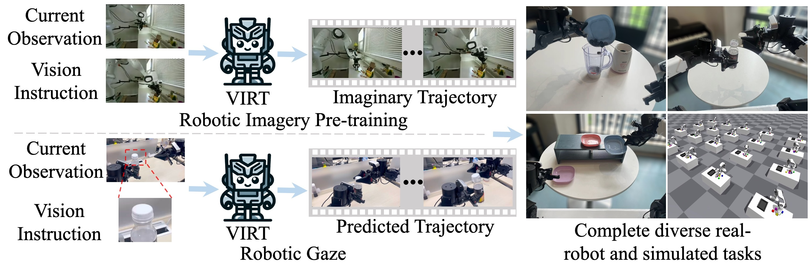

# VIRT: Vision Instructed Robotic Transformer for Manipulation Learning

[[`Project Page`](https://lizhuoling.github.io/VIRT_webpage/)] [[`Paper Page`](https://arxiv.org/pdf/2410.07169)] [[`Code Link`](https://github.com/Lizhuoling/VIRT)] [[`Data Link`](https://huggingface.co/datasets/Zhuoling98/VIRT_data)]

This is the official implementation of the paper "VIRT: Vision Instructed Robotic Transformer for Manipulation Learning".

<p align="center">
    
</p>

## Table of Contents:
1. [Installation](#installation)
2. [Data](#data)
3. [Pre-trained Model](#Model)
4. [Training](#training)
5. [Evaluation](#evaluation)
6. [License](#license)
7. [Citing](#citing)


## Installation <a name="installation"></a>
To prepare the environment, please first create a conda environment with the following command. We do not recommend using other python versions because Isaac Gym may not support them.
``` bash
conda create -n VIRT python=3.8
conda activate VIRT
```
Then, please install Isaac Gym following the instructions in [Isaac Gym](https://developer.nvidia.com/isaac-gym). Our used version is 1.0.preview4. You need to install Isaac Gym using a computer with visualization and at least a GPU. Cuda should also be installed. After installing Isaac Gym, move to the installation path and run the following commands:
```
cd isaacgym/python
pip install -e .
```
Now, please go to the root directory of this project and install the following dependencies:
```
pip install torch==2.3.1 torchvision==0.18.1
pip install pyquaternion
pip install pyyaml
pip install rospkg
pip install pexpect
pip install opencv-python
pip install matplotlib
pip install einops
pip install packaging
pip install h5py
pip install ipython
pip install xformers==0.0.27
pip install tensorboard
pip install tqdm
cd VIRT/detr && pip install -e . && cd ../..
```

## Data <a name="data"></a>
We provide our collected teleoperation data of the three simulated tasks, including 'Move a Single Box', 'Transport the Specified Box', and 'Stack the Specified Boxes'. You can download the data from [here](https://huggingface.co/datasets/Zhuoling98/VIRT_data).  Please unzip the data and put it in the `ROOT/VIRT/datasets` directory. The data saving structure should look like:
```
$ROOT/VIRT/datasets
├── isaac_singlebox
│   ├── h5py
│   ├── exterior_camera1
│   ├── exterior_camera2
│   ├── top_camera
│   ├── wrist_camera
├── isaac_singlecolorbox
├── isaac_multicolorbox
```
The folders `isaac_singlebox`, `isaac_singlecolorbox`, and `isaac_multicolorbox` correspond to the aforementioned three simulated tasks, respectively.

## Pre-trained Model <a name="Model"></a>

We provide the policy weight of the VIRT model pre-trained by the proposed RIP paradigm at [here](https://huggingface.co/Zhuoling98/VIRT_droid_pretrain). Please download it and save it as `$ROOT/VIRT/pretrained/VIRT_droid_pretrain.ckpt`.

## Training <a name="training"></a>

For training VIRT, you can run the following script template at `ROOT/VIRT`:
``` bash
torchrun --nnodes=$nnodes --nproc_per_node=$nproc_per_node --node_rank=$node_rank --master_addr=$master_addr --master_port $master_port \
    main.py \
    --config_name $config_name \
    --save_dir ./outputs/$exp_id \
    --data_dir $data_path \
    --num_nodes $nnodes \
    --load_pretrain pretrained/VIRT_droid_pretrain.ckpt
```
Specifically, we provide config names of the three provided simulated tasks in `$ROOT/VIRT/configs`, and `$config_name` is the path of the config file corresponding the experiment you want to try. The variable `$data_path` is the path to the corresponding dataset, e.g., `$ROOT/VIRT/datasets/isaac_singlebox` for the task `Move a Single Box`. The training logs and checkpoint models will be saved in `./outputs/$exp_id`. If you only want to use one GPU to train, the variables `$nnodes`, `$nproc_per_node`, and `$node_rank` should be set to `1`, `1`, and `0`, respectively. `$master_addr` is the IP address of your computer and can be set to `127.0.0.1`. `$master_port` can be `29515`, and it must be different for different experiments if you are running multiple experiments simultaneously. Our code supports multi-mode multi-GPU training.

## Evaluation <a name="evaluation"></a>

For evaluating the trained policy, you can follow the script command template as follows:
``` bash
torchrun --nnodes=$nnodes --nproc_per_node=$nproc_per_node --node_rank=$node_rank --master_addr=$master_addr --master_port $master_port \
    main.py \
    --config_name $config_name \
    --save_dir outputs/$exp_id \
    --load_dir outputs/$exp_id/policy_latest.ckpt \
    --num_nodes $nnodes \
    --eval
```
The variables are set in the same way as the training script.

## License <a name="license"></a>
This project is released under [CC-BY-NC 4.0](LICENSE.md).

## Citing <a name="citing"></a>

Please use the following BibTeX entry if you find our work useful:

```BibTeX
@article{li2024virt,
  title={VIRT: Vision Instructed Robotic Transformer for Manipulation Learning},
  author={Zhuoling, Li and Liangliang, Ren and Jinrong, Yang and Yong, Zhao and others},
  journal={arXiv preprint arXiv:2410.07169},
  year={2024}
}
```

